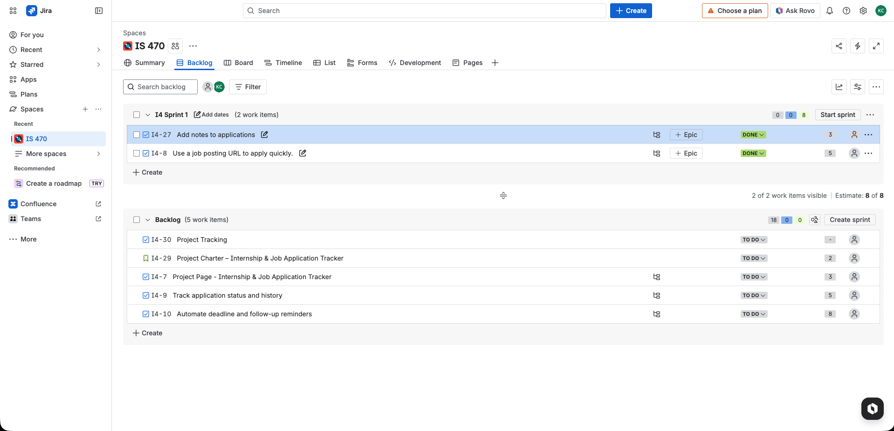

# Homework 8 – Personal Project Completion

## 1. Summary of Product Backlog Delivered by End of Sprint 2

By the end of Sprint 2, I completed two backlog items for my personal project, the Internship & Job Application Tracker.

The completed tasks include:
- Add notes to applications
- Use a job posting URL to apply quickly

These features help improve the usability of the system by allowing users to store notes for job applications and quickly access job posting links.

---
## 2. Product Burndown Chart

The burndown chart tracks the remaining story points in the backlog as work is completed during the project.

Burndown Chart:  
https://docs.google.com/spreadsheets/d/1oZXmBZKDLp4fqc5RalqCYr5yNrf4FDc12FprBgs1DJ0/edit?gid=0#gid=0
---
## 3. Personal Project Retrospective

During this sprint, I learned how to organize project work using Agile practices such as maintaining a backlog and using story points. Breaking the work into smaller tasks helped me stay focused and track my progress more clearly.

One challenge I experienced was estimating the effort required for each task. In the future, I plan to improve my estimation and continue updating my backlog regularly so I can better manage project progress.
